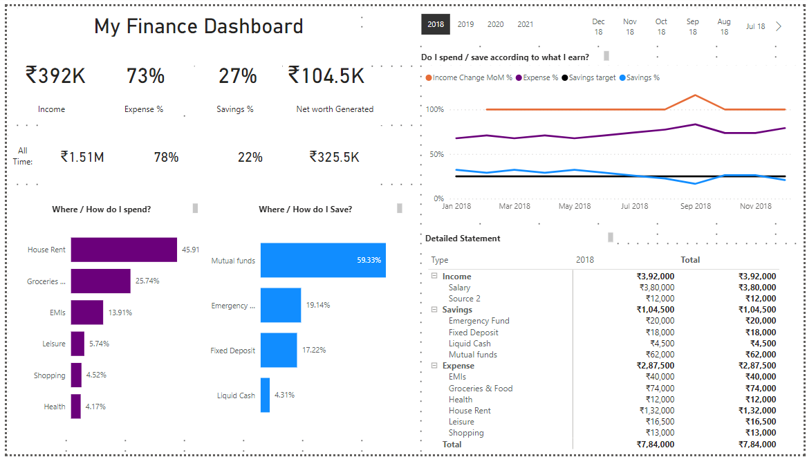

# Personal Finance Dashboard

This project aims to provide users with a comprehensive tool for managing and visualizing their personal finances. The system is divided into two main components: a Python script for managing the Excel sheet data and a Power BI dashboard for visualization. You can input your income, expenses, and savings for different months and view them in a structured manner.

## Features

- Add income: Track your sources of income, along with the amount.
- Add expenses: Monitor your expenses by category, such as groceries, utilities, etc.
- Add savings: Keep track of your savings, specifying the type and amount saved.
- Input for multiple months: Input financial data for different months.
- Excel output: All your financial data is saved in an Excel file for easy access and analysis.
- power BI dashboard : Visualize your finances and derive inference
  

The combination of the Python script for data management and the Power BI dashboard for visualization creates a powerful tool for managing personal finances. Users can easily track their financial activities, identify spending patterns, and make adjustments to their budget as needed, all in one convenient dashboard.

